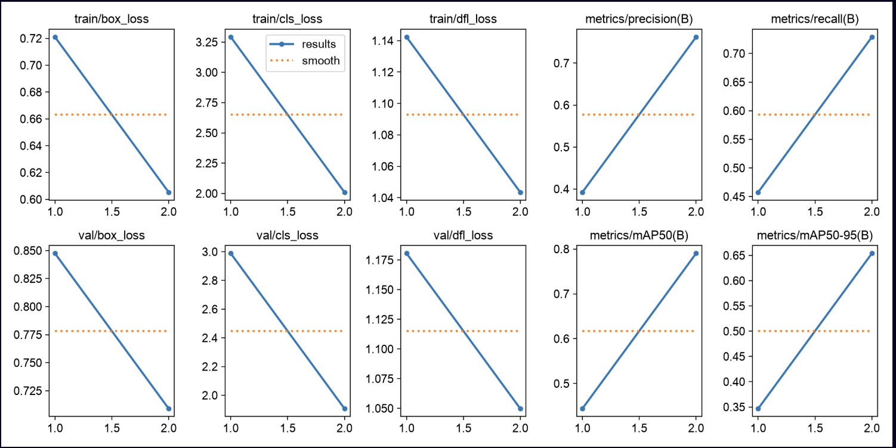
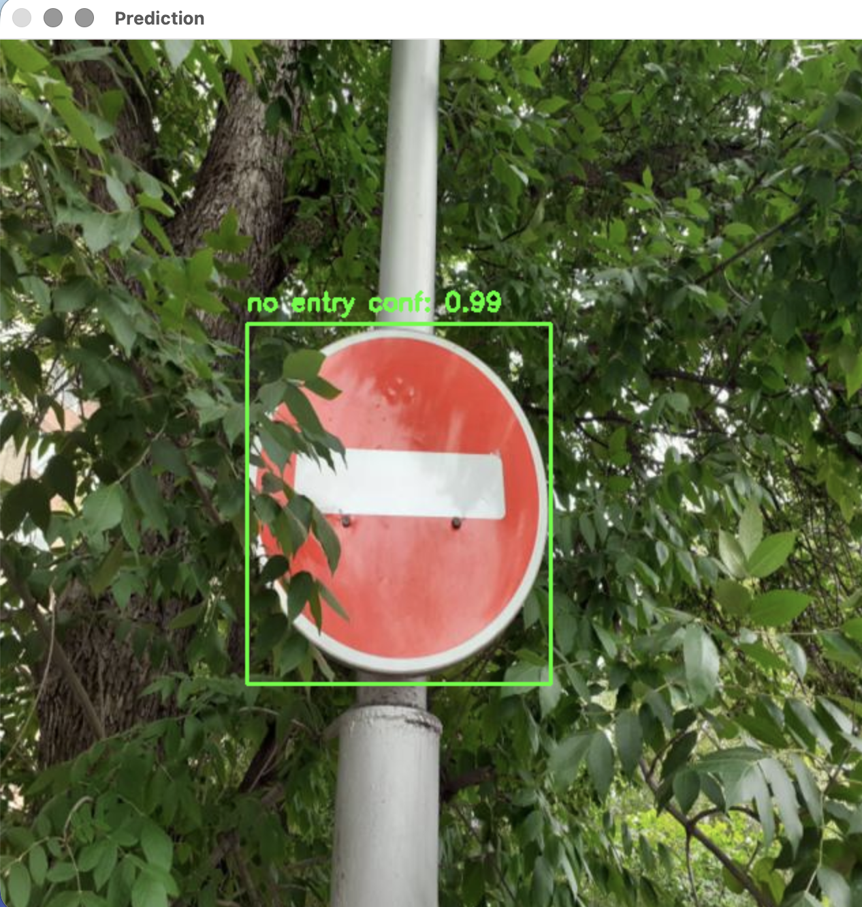
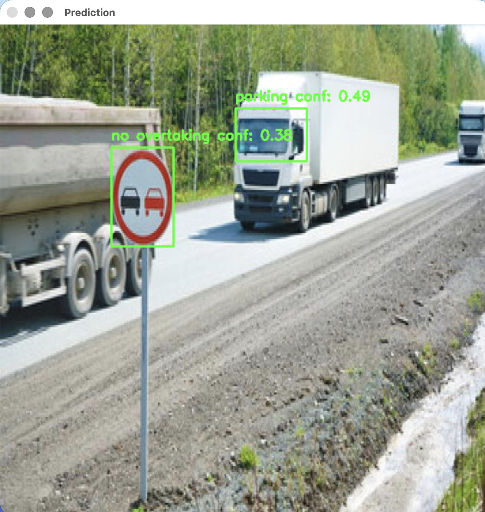
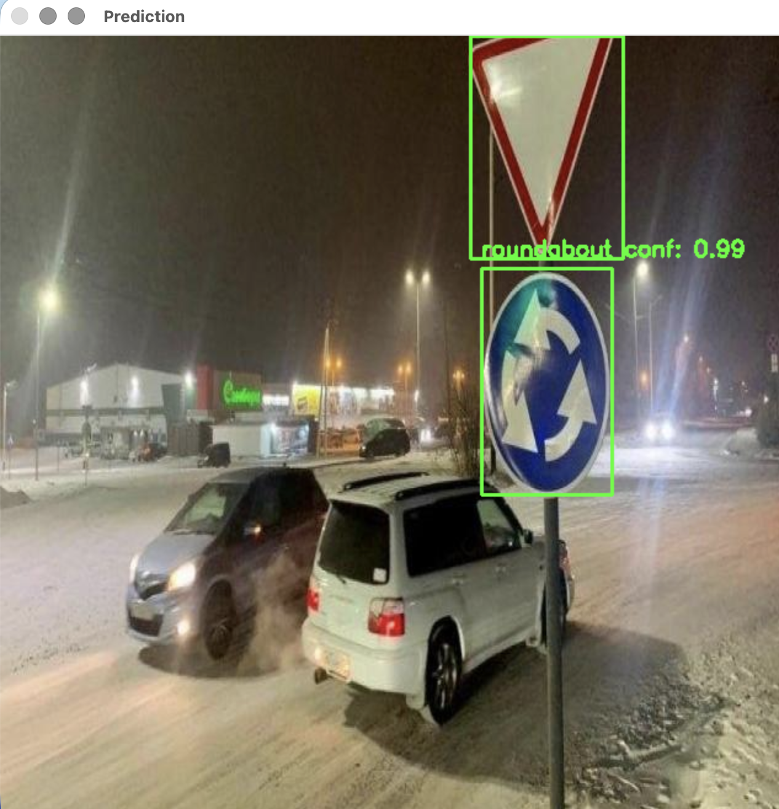

# Traffic Sign Detection with YOLOv8

This project demonstrates how to train a custom **YOLOv8 Nano** object detection model to recognize traffic signs using a custom dataset. Instead of training a neural network from scratch, a pre-trained YOLOv8 model was fine-tuned using transfer learning, allowing the model to learn new traffic sign classes efficiently.

The project covers the complete object detection workflow, including dataset preparation, model training, evaluation, inference on unseen images and visualization of predictions.

Besides demonstrating the implementation of YOLOv8, this repository is intended to serve as a step-by-step guide for anyone interested in training a custom object detection model.

## Features

- Fine-tuning a pre-trained YOLOv8 Nano model
- Custom traffic sign dataset
- Dataset configuration using `data.yaml`
- Model training and validation
- Evaluation using Precision, Recall and mAP metrics
- Object detection on unseen images
- Bounding box visualization with OpenCV
- Confidence threshold experimentation
- False positive analysis
- Troubleshooting guide

# Project Structure

```text
traffic-sign-detection-yolo/
│
├── dataset/
│   ├── train/
│   │   ├── images/
│   │   └── labels/
│   │
│   ├── valid/
│   │   ├── images/
│   │   └── labels/
│   │
│   ├── test/
│   │   ├── images/
│   │   └── labels/
│   │
│   └── data.yaml
│
├── runs/
│   └── detect/
│
├── images/
│   ├── results.png
│   ├── confusion_matrix.png
│   ├── test1.jpg
│   ├── prediction1.jpg
│   ├── test2.jpg
│   ├── prediction2.jpg
│   ├── test3.jpg
│   └── prediction3.jpg
│
├── train.py
├── test.py
├── requirements.txt
└── README.md
```

# Dataset

This project uses the **Traffic Sign Detection YOLOv8** dataset downloaded from **Roboflow Universe**.

**Dataset Source**

https://universe.roboflow.com/university-km5u7/traffic-sign-detection-yolov8-awuus/dataset/8

The dataset is provided in **YOLOv8 format** which includes:

- Training set
- Validation set
- Test set
- Bounding box annotations
- Dataset configuration (`data.yaml`)

The original dataset contains **18 traffic sign classes** including:

- Bend Left
- Bend Right
- Hump
- No Entry
- No Left Turn
- No Overtaking
- No Right Turn
- No Stopping
- No U Turn
- No Waiting
- Parking
- Roadwork
- Roundabout
- Speed Limit 40
- Stop
- T-Hump
- Turn Left
- Turn Right

For this project, the dataset was downloaded in **YOLOv8 format** and organized into the standard YOLO directory structure.

Each image has a corresponding annotation file with normalized bounding box coordinates.

Example annotation:

```text
0 0.53 0.42 0.18 0.22
```

Where:

| Value | Description |
|--------|-------------|
| 0 | Class ID |
| 0.53 | X center (normalized) |
| 0.42 | Y center (normalized) |
| 0.18 | Bounding box width (normalized) |
| 0.22 | Bounding box height (normalized) |

Although the original dataset contains 18 classes, this project was trained using 15 selected traffic sign classes defined in `data.yaml`.

# Dataset Structure

YOLO expects the following directory structure.

```text
dataset/

    train/
        images/
        labels/

    valid/
        images/
        labels/

    test/
        images/
        labels/
```

Each image inside the **images** folder must have a matching annotation file inside the **labels** folder.

For example,

```text
train/images/image001.jpg

↓

train/labels/image001.txt
```

# Configure `data.yaml`

YOLO uses the `data.yaml` file to locate the dataset and identify the available object classes.

Example configuration:

```yaml
train: dataset/train/images
val: dataset/valid/images
test: dataset/test/images

nc: 15

names:
  0: bend right
  1: hump
  2: no entry
  3: no left turn
  4: no overtaking
  5: no right turn
  6: no stopping
  7: no u turn
  8: no waiting
  9: roadwork
  10: roundabout
  11: speed limit 40
  12: stop
  13: turn left
  14: turn right
```

## data.yaml Parameters

| Parameter | Description |
|-----------|-------------|
| `train` | Path to the training images |
| `val` | Path to the validation images |
| `test` | Path to the test images |
| `nc` | Number of object classes |
| `names` | List of class labels |

# Environment Setup

Clone the repository.

```bash
git clone https://github.com/your-username/traffic-sign-detection-yolo.git
```

Move into the project directory.

```bash
cd traffic-sign-detection-yolo
```

Create a virtual environment.

```bash
python -m venv venv
```

Activate the virtual environment.

### macOS / Linux

```bash
source venv/bin/activate
```

### Windows

```bash
venv\Scripts\activate
```

Install the required packages.

```bash
pip install ultralytics
pip install opencv-python
```

or install everything at once.

```bash
pip install -r requirements.txt
```

After installation, verify that YOLO is available.

```bash
python -c "from ultralytics import YOLO; print('YOLO successfully installed.')"
```

# Training Workflow

The model was trained using **transfer learning** which means starting from a pre-trained YOLOv8 Nano model instead of training a neural network from scratch.

Training from scratch typically requires a very large dataset and a significant amount of computational resources. Since traffic sign datasets are relatively small compared to datasets such as COCO, transfer learning allows the model to converge faster while achieving better performance.

The complete training workflow is illustrated below.

```text
Download Dataset
        │
        ▼
Configure data.yaml
        │
        ▼
Load YOLOv8 Nano
        │
        ▼
Fine-Tune the Model
        │
        ▼
Validate after each Epoch
        │
        ▼
Save best.pt
        │
        ▼
Run Inference
```

# Step 1 — Load the Pre-trained Model

The first step is loading a pre-trained YOLOv8 Nano model.

```python
from ultralytics import YOLO

model = YOLO("yolov8n.pt")
```

The file `yolov8n.pt` contains weights that were previously trained on the COCO dataset.

Instead of learning basic visual features from scratch, the model already understands general concepts such as edges, shapes and objects. During fine-tuning, these learned features are adapted to recognize custom traffic signs.

# Step 2 — Train the Model

Training is performed using the `train()` method.

```python
model.train(
    data="dataset/data.yaml",
    epochs=20,
    imgsz=640,
    batch=16,
    name="traffic-sign-model"
)
```

During training, the following process is repeated for every epoch.

```text
Training Images
        │
        ▼
Forward Pass
        │
        ▼
Model Predictions
        │
        ▼
Loss Calculation
        │
        ▼
Backpropagation
        │
        ▼
Weight Update
        │
        ▼
Next Batch
```

After all training batches have been processed, one epoch is completed.

The validation dataset is then evaluated before the next epoch begins.

# Understanding Training Parameters

The following parameters control how YOLO trains the model.

| Parameter | Description |
|-----------|-------------|
| `data` | Path to the dataset configuration file. |
| `epochs` | Number of complete passes through the training dataset. |
| `imgsz` | Image resolution used during training. |
| `batch` | Number of images processed before updating the weights. |
| `name` | Name of the folder where training results are saved. |

## data

```python
data="dataset/data.yaml"
```

This parameter tells YOLO where the dataset is located.

The `data.yaml` file also specifies:

- training images
- validation images
- test images
- number of classes
- class names

Without this file, YOLO would not know where to find the dataset.

## epochs

```python
epochs=20
```

An epoch represents one complete pass through the entire training dataset.

For example,

```text
1000 Training Images

↓

Epoch 1

↓

1000 Images Again

↓

Epoch 2
```

If the model is trained for **20 epochs**, it sees every training image twenty times.

During this project, multiple experiments were performed using different epoch values (**5**, **10** and **20**) to observe how training duration affects model performance.

Increasing the number of epochs generally improved the detection results. However, excessively large values may eventually lead to overfitting.

## imgsz

```python
imgsz=640
```

Before entering the neural network, every image is resized to

```text
640 × 640
```

Using a larger image size may improve the detection of small objects but also increases training time and memory usage.

## batch

```python
batch=16
```

Instead of processing images one at a time, YOLO processes multiple images together.

Example:

```text
Image 1
Image 2
...
Image 16

↓

Forward Pass

↓

Loss Calculation

↓

Weight Update
```

A larger batch size generally improves GPU utilization, although it also requires more memory.

## name

```python
name="traffic-sign-model"
```

YOLO automatically creates an output directory using this name.

Example:

```text
runs/
    detect/
        traffic-sign-model/
```

This folder contains:

- trained model weights
- training graphs
- validation results
- prediction examples
- confusion matrix

# Monitoring the Training Process

During training, YOLO continuously reports several metrics that indicate how well the model is learning.

The three primary training losses are:

- Box Loss
- Classification Loss
- DFL Loss

These values should generally decrease as training progresses.

# Understanding Training Metrics

During training, YOLO continuously reports several metrics that indicate how well the model is learning.

As training progresses, the loss values should generally decrease, while the evaluation metrics should improve.

## Box Loss

Box Loss measures how accurately the predicted bounding boxes match the ground-truth bounding boxes.

A lower Box Loss indicates that the model is becoming better at locating objects.

Example:

```text
Ground Truth

┌─────────────┐
│   STOP      │
└─────────────┘

Prediction

┌──────────┐
│  STOP    │
└──────────┘
```

If the predicted box closely overlaps the ground-truth box, the Box Loss decreases.

Typical values after successful training are approximately:

```text
0.1 – 0.3
```

Lower values indicate better localization.

## Classification Loss

Classification Loss measures how accurately the model predicts the correct object class.

For example,

```text
Ground Truth

STOP

Prediction

STOP
```

produces a low classification loss.

However,

```text
Ground Truth

STOP

Prediction

Speed Limit
```

produces a much higher classification loss.

Lower values indicate better classification performance.

Typical values after training are usually

```text
< 1
```

## DFL Loss (Distribution Focal Loss)

DFL Loss improves the precision of bounding box localization.

Instead of predicting only the four box coordinates, YOLO estimates a probability distribution for each coordinate, allowing more accurate object localization.

Lower DFL Loss generally indicates more precise bounding boxes.

Typical values are approximately

```text
0.5 – 1
```

# Validation Metrics

After each training epoch, YOLO automatically evaluates the model using the validation dataset.

Example output:

```text
Precision : 0.83
Recall    : 0.81
mAP50     : 0.92
mAP50-95  : 0.68
```

These metrics provide a better indication of model performance than the training loss alone.

## Precision

Precision measures how many predicted objects are actually correct.

Formula:

```text
Precision = TP / (TP + FP)
```

A high Precision means the model produces fewer false positives.

Example:

```text
Predicted Objects

10

Correct Predictions

9

Precision = 90%
```

## Recall

Recall measures how many actual objects the model successfully detects.

Formula:

```text
Recall = TP / (TP + FN)
```

A high Recall means the model misses fewer objects.

Example:

```text
Actual Traffic Signs

10

Detected

8

Recall = 80%
```

## mAP50

mAP (Mean Average Precision) is the most commonly used evaluation metric for object detection.

The **50** indicates that a predicted bounding box is considered correct if its Intersection over Union (IoU) is at least **0.50**.

Higher values indicate better performance.

## mAP50-95

This metric is more challenging.

Instead of evaluating only IoU = 0.50, it averages the model performance across multiple IoU thresholds from **0.50** to **0.95**.

Because it requires much more precise localization, the mAP50-95 score is almost always lower than mAP50.

It is considered the primary benchmark for modern object detection models.

# Training Results

YOLO automatically generates several files after training.

```text
runs/
    detect/
        traffic-sign-model/
```

Inside this folder, several useful outputs are saved automatically.

Examples include:

- results.png
- confusion_matrix.png
- labels.jpg
- labels_correlogram.jpg
- weights/
- predictions

These visualizations make it easier to evaluate how well the model learned during training.

## Training Curves

The `results.png` file summarizes the entire training process.

It includes:

- Training Loss
- Validation Loss
- Precision
- Recall
- mAP50
- mAP50-95

Example:



As training progresses:

- Loss values should decrease.
- Precision should increase.
- Recall should increase.
- mAP values should increase.

# Saving the Trained Model

At the end of training, YOLO automatically saves two checkpoints.

```text
best.pt
```

This model achieved the best validation performance during training.

```text
last.pt
```

This model contains the weights from the final training epoch.

Although `last.pt` represents the most recent epoch, it is not always the best-performing model.

For inference, the **best.pt** checkpoint was used because it achieved the highest validation performance.

# Running Inference

After training, the best-performing model was loaded to perform object detection on unseen images.

```python
from ultralytics import YOLO

model = YOLO("runs/detect/traffic-sign-model/weights/best.pt")
```

The `best.pt` checkpoint was selected because it achieved the highest validation performance during training.

# Loading an Image

The input image is loaded using OpenCV.

```python
image_path = "test1.jpg"
image = cv2.imread(image_path)
```

The same script can be used to test different images by changing the file name.

```python
image_path = "test2.jpg"
```

or

```python
image_path = "test3.jpg"
```

# Running Object Detection

Object detection is performed using the trained model.

```python
results = model(image_path, conf=0.25)[0]
```

The `conf` parameter defines the minimum confidence score required for a prediction to be accepted.

For example,

```python
conf=0.25
```

means detections with confidence lower than **25%** are discarded.

During experimentation, the confidence threshold was also reduced to

```python
results = model(image_path, conf=0.10)[0]
```

Reducing the confidence threshold increased the number of detections but also introduced more false positives.

# Visualizing Predictions

Each detected object contains:

- Bounding box coordinates
- Predicted class
- Confidence score

The following code draws the predictions on the original image.

```python
for box in results.boxes:

    x1, y1, x2, y2 = map(int, box.xyxy[0])

    cls_id = int(box.cls[0])

    confidence = float(box.conf[0])

    label = f"{model.names[cls_id]} ({confidence:.2f})"

    cv2.rectangle(
        image,
        (x1, y1),
        (x2, y2),
        (0,255,0),
        2
    )

    cv2.putText(
        image,
        label,
        (x1, y1-10),
        cv2.FONT_HERSHEY_SIMPLEX,
        0.6,
        (0,255,0),
        2
    )
```

Finally, the prediction is displayed and saved.

```python
cv2.imshow("Prediction", image)
cv2.waitKey(0)
cv2.destroyAllWindows()

cv2.imwrite("prediction_result.jpg", image)
```

# Sample Predictions

The trained model was evaluated on three unseen traffic sign images.

## Test Image 1



The model successfully detected a **No Entry** traffic sign with a high confidence score.

## Test Image 2



The model correctly detected the traffic sign but also produced a false positive by classifying part of a truck windshield as a parking sign.

## Test Image 3



The model correctly identified the traffic sign under different viewing conditions and object placement.

# Experimental Observations

Several experiments were conducted during this project to better understand how different training and inference parameters affect model performance.

## Epoch Comparison

The model was trained using different epoch values.

| Epochs | Observation |
|---------|-------------|
| 5 | The model learned basic traffic sign features but produced lower accuracy. |
| 10 | Detection performance improved and predictions became more stable. |
| 20 | Produced the best overall performance with higher confidence scores. |

Increasing the number of training epochs improved the model's ability to recognize traffic signs, although excessively large values may eventually lead to overfitting.

## Confidence Threshold Experiment

Two confidence thresholds were tested.

| Confidence | Observation |
|------------|-------------|
| 0.25 | More reliable predictions with fewer false positives. |
| 0.10 | More detections but significantly more false positives. |

This experiment demonstrates the trade-off between sensitivity and prediction reliability.

# False Positive Analysis

Although the model performed well on many traffic signs, several incorrect predictions were observed.

Examples include:

- A truck windshield being classified as a parking sign.
- Some traffic signs being confused with visually similar classes.
- Small traffic signs occasionally being missed.

These errors mainly occurred because of:

- Limited training data
- Small object size
- Similar visual appearance between different objects
- Low confidence threshold

# Challenges Encountered

Several implementation issues were encountered and resolved during development.

| Issue | Solution |
|--------|----------|
| Virtual environment was not activated | Activated the Python virtual environment before running the project. |
| `ModuleNotFoundError` | Installed missing dependencies inside the virtual environment. |
| Incorrect image paths | Updated image paths to the correct file locations. |
| `KeyError: tensor()` | Converted the predicted class ID from a tensor to an integer using `int(box.cls[0])`. |
| OpenCV window did not close | Closed the window using keyboard input or terminated the process when necessary. |
| False positive detections | Increased the confidence threshold to reduce incorrect predictions. |

# Future Improvements

Possible improvements for this project include:

- Training on a larger and more diverse traffic sign dataset.
- Increasing the number of training images for underrepresented classes.
- Comparing different YOLOv8 model sizes (Nano, Small, Medium and Large).
- Real-time traffic sign detection using a webcam.
- Video-based traffic sign detection.
- Hyperparameter optimization to further improve detection accuracy.

# Conclusion

This project demonstrated the complete workflow of training a custom YOLOv8 object detection model using transfer learning.

A pre-trained YOLOv8 Nano model was successfully fine-tuned on a custom traffic sign dataset and evaluated on unseen images. The trained model was able to detect multiple traffic sign classes while visualizing predictions with bounding boxes and confidence scores.

Throughout the project, different epoch values and confidence thresholds were explored to better understand their impact on model performance. These experiments also highlighted common object detection challenges such as false positives, small object detection and the influence of confidence thresholds on prediction quality.

Overall, this project provides a practical introduction to training, evaluating and deploying custom YOLOv8 object detection models while serving as a reproducible guide for anyone interested in building similar computer vision applications.
